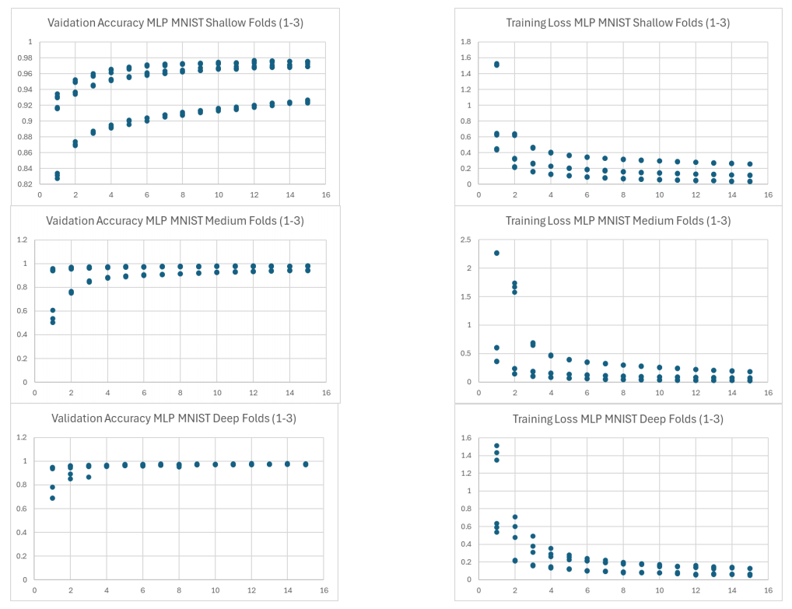
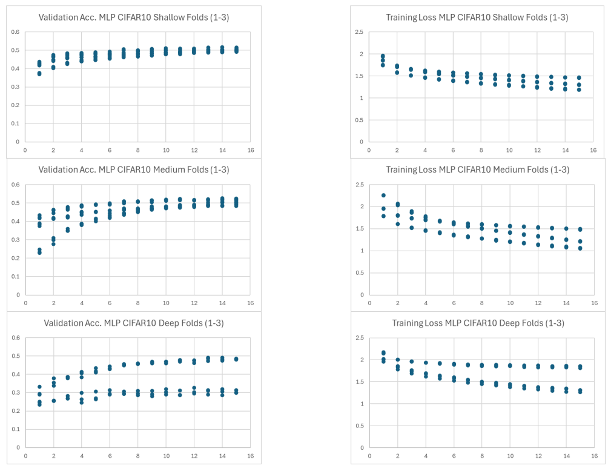
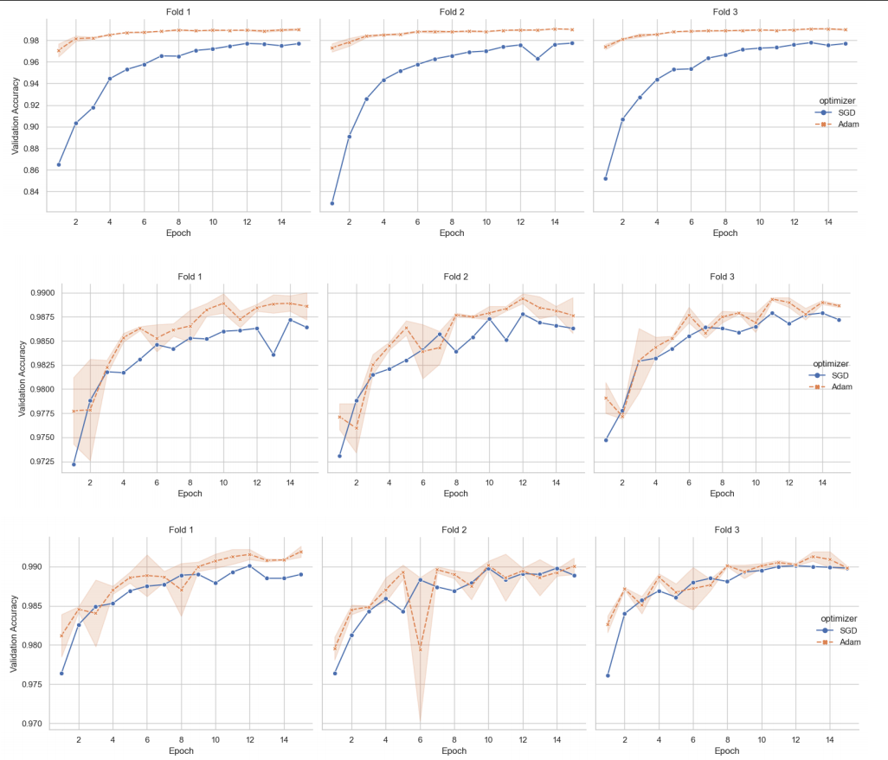
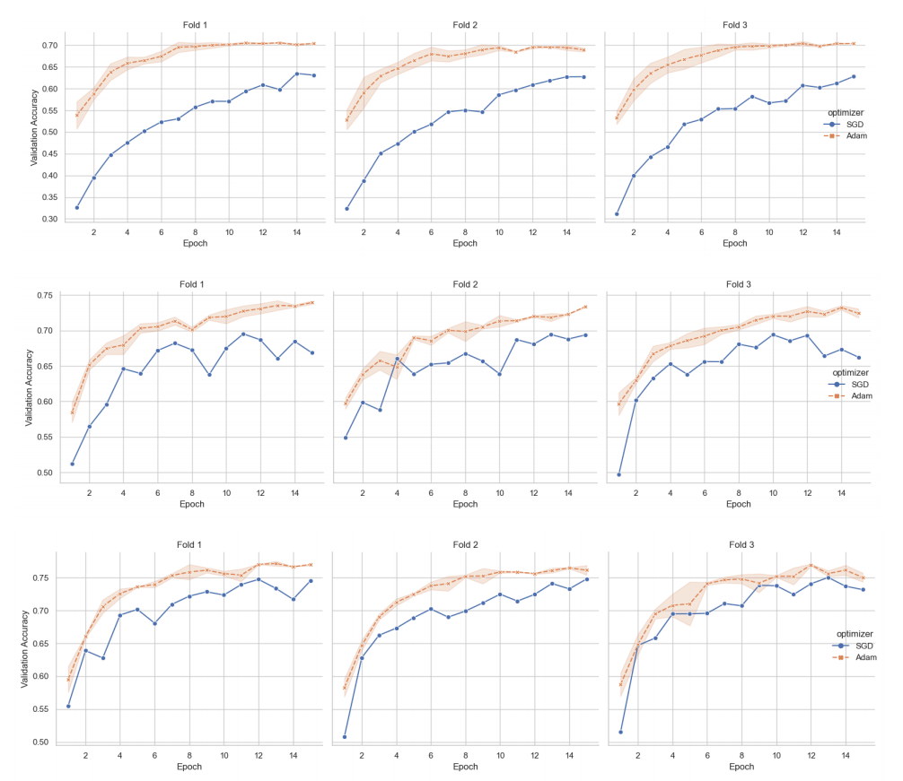

# MNIST & CIFAR‑10: 
## MLP and CNN Benchmark

This project benchmarks three multilayer‑perceptron (MLP) architectures against three convolutional‑neural‑network (CNN) architectures on **MNIST** (digit image classification) and **CIFAR‑10** (natural 32 × 32 color images).  

A 3‑fold cross‑validation grid explores learning rate, batch size, optimizer and dropout choices. All training logs are parsed into tidy CSVs for analysis and plotting.

---
## Dataset

| Dataset  | Samples                    | Classes | Input shape |
| -------- | -------------------------- | ------- | ----------- |
| MNIST    | 60 000 train / 10 000 test | 10      | 1 × 28 × 28 |
| CIFAR‑10 | 50 000 train / 10 000 test | 10      | 3 × 32 × 32 |

---

## Model families & search space

|Family|Variants|Layers / Channels|Dropout explored|
|---|---|---|---|
|**MLP**|_Shallow_, _Medium_, _Deep_|1 → 7 hidden linear layers (128 → 4096 units)|0 / 0.2 / 0.5|
|**CNN**|_Baseline_, _Enhanced_, _Deep_|2 → 8 conv blocks, optional BatchNorm|0 / 0.25 / 0.5|
Hyper‑parameters explored:

```
Learning rate: {0.01, 0.001}
Batch size   : {64, 128}
Optimiser    : {SGD, Adam}
```

Implementation details in **`mlp_mnist_cifar.py`** and **`cnn_mnist_cifar.py`**

---
## Reproducing the experiments

```bash
# 1. Install requirements
conda create -n cv_bench python=3.11
conda activate cv_bench
pip install torch torchvision scikit-learn pandas numpy matplotlib seaborn

# 2. Run MLP grid
python mlp_mnist_cifar.py          # ≈2 h on CPU – use CUDA for speed

# 3. Run CNN grid
python cnn_mnist_cifar.py          # ≈4 h on CPU

# 4. Parse logs → CSV
python re_csv.py                   # creates parsed_results.csv 

# 5. (Optional) Visualise validation curves
python plot_data.py                # strips log → val_accuracy_strip.csv 
python plot_data1.py               # FacetGrid of val‑accuracy trajectories 

```

All raw logs are saved to `results.txt` for inspection.

---
## Results (mean ± std across 3 folds)

|Dataset|Best **MLP**|Best **CNN**|∆ Accuracy|
|---|---|---|---|
|**MNIST**|0.9792 ± 0.0008 (Medium, Adam 0.001, 64)|**0.9906 ± 0.0010** (CNNDeep, Adam 0.001, 64)|**+1.15 pp**|
|**CIFAR‑10**|0.5210 ± 0.0031 (Medium, Adam 0.001, 64)|**0.7646 ± 0.0120** (CNNDeep, Adam 0.001, 64)|**+24.3 pp**|

Average training wall‑time per fold:

- MLP‑Shallow (MNIST) ≈ 4 min
    
- CNN‑Deep (CIFAR‑10)  ≈ 13 min









---
## Key findings

1. **CNNs dominate MLPs.** Weight sharing and local‑receptive fields let CNNs exploit spatial coherence, lifting accuracy by 1 pp on MNIST and 24 pp on CIFAR‑10.
    
2. **Depth helps.** Deeper CNNs (additional conv blocks + dense head) yielded the top score on both datasets.
    
3. **Adam > SGD at low LR.** Across grids, Adam (0.001) consistently outperformed SGD (0.01) while converging faster.
    
4. **Heavier data ≠ linear gains.** CIFAR‑10 remains challenging; even CNNDeep saturates at ≈ 76 %‑accuracy without data‑augmentation.

---
### Requirements

```
.
├── mlp_mnist_cifar.py   # MLP pipeline
├── cnn_mnist_cifar.py   # CNN pipeline
├── re_csv.py            # log → CSV parser
├── plot_data*.py        # visualisations
├── results.txt          # condensed training logs
└── data/                # Torchvision auto‑download
```

- Python ≥ 3.10
    
- PyTorch ≥ 2.3 with CUDA 11+ (optional but recommended)
    
- torchvision, scikit‑learn, pandas, numpy, matplotlib, seaborn

---
### License

MIT